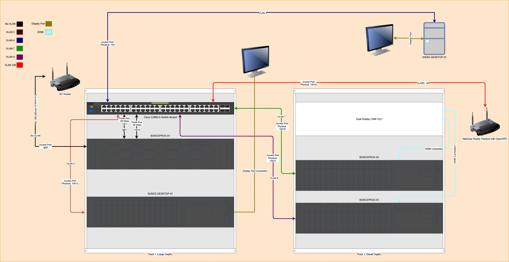
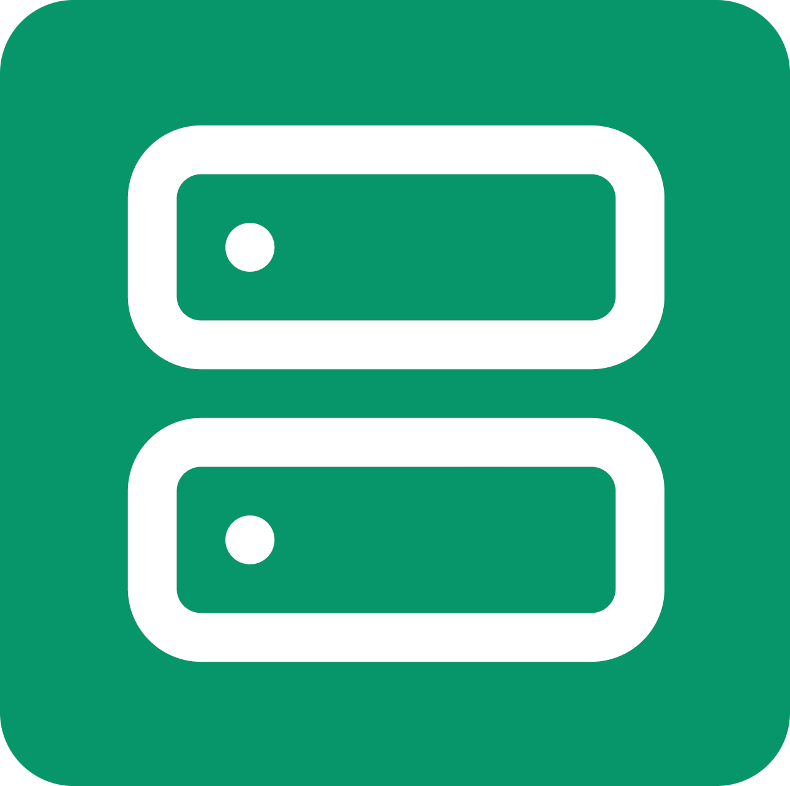
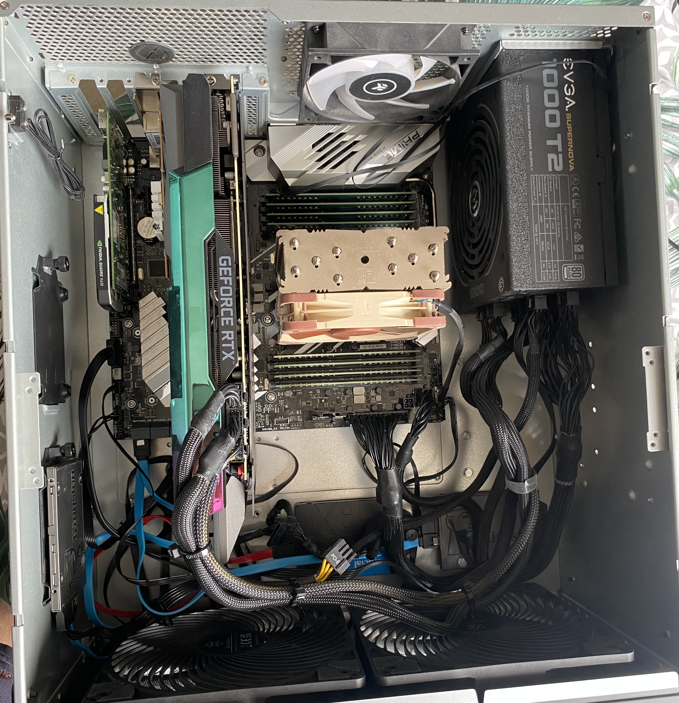
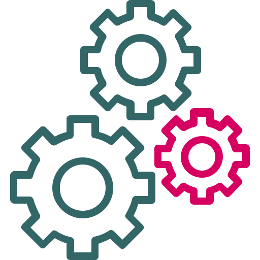
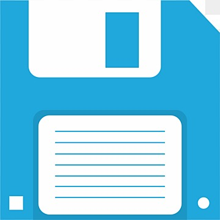
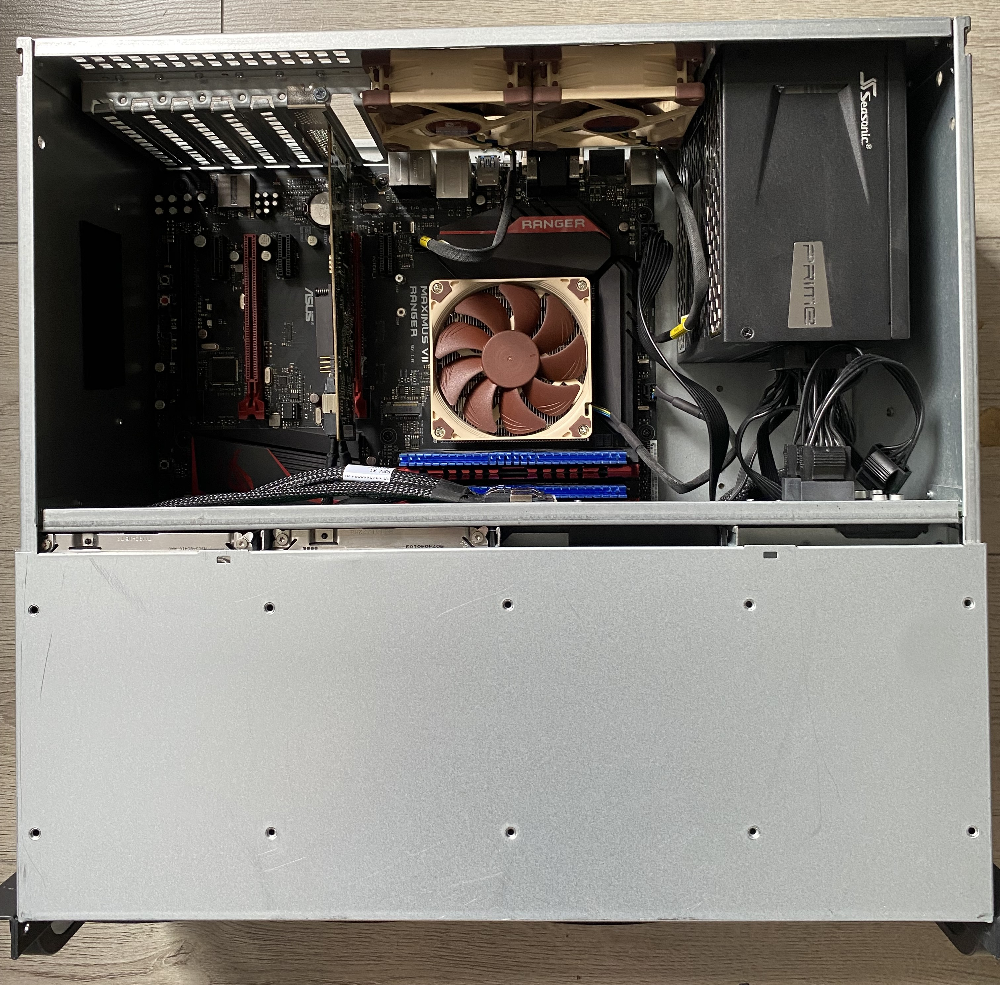
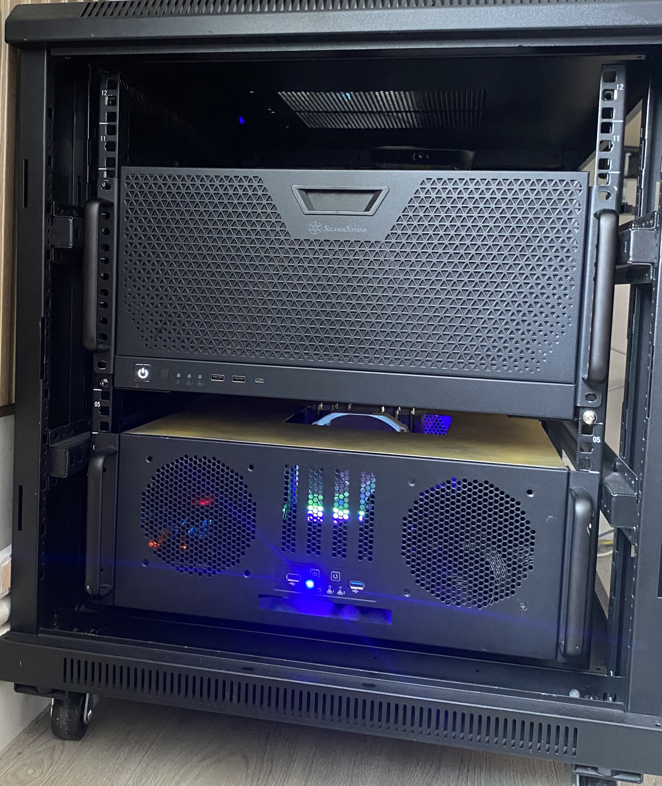
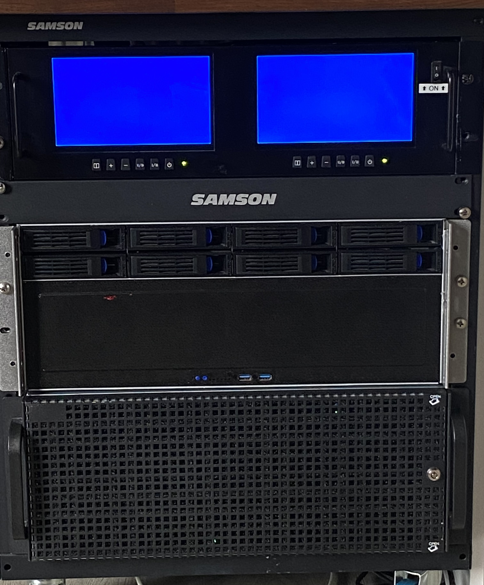

#  Welcome to the Homelab Journey
 # 
The purpose of this repo is to document my journey and the processes I use throughout building my homelab, the homelab will be used for hosting critical services that i used on a daily basis and to hone my skills in deploying secure systems

#  Goals/Objectives

The main objectives i hope to achieve with this homelab is the following:
- High level understanding of github branching and merging 
- Ability to clearly document my journey and identify the best method for doing this
- To have a Homelab which is secure and as safe as possible (without disconnecting it from the internet)

The Main Services i want to have running (note this list may change):
- SIEM (such as wazuh)
- Syslog Server (such as Graylog)
- Automation of updates and patching (Anisble/n8n)
- Self Hosted AI (Hermes for example)
- Windows AD server
- Docker Server hosting production application such as (Lubelogger, Mealie, Gitea, and tududi)
- Firewall with defined and commented ruling (such as OPNSENSE)
- Reverse Proxy (Traefik)
- Proxmox VM Backup server (ProxmoxBackupServer (PBS))
- Shared Network drive with locked down access (TrueNas)
- Uptime and Service Monitoring (uptime-kuma, etc)
- Central Repository of Assets (NetBox)
- Lab environment (EVE-NG)
- Coding VM (Python)
- Pentesting/Automated Scanner (Linux Mint, Lynis, OpenVAS etc)

To do all of the above I will be using the following servers

#  Servers & Hardware

#  Prod Server BUNCEPROX01
# 
# Specs: 
- CPU: Ryzen Threadripper 1950x 16 cores 32 threads
- RAM: 128GB Ram
- GPU 1: RTX 3090 24GB
- GPU 2: Nvidia Quadro K620
- Mobo: ASUS PRIME X399-A MotherBoard
- Chassis: 5U Case

# Storage:
- CT4000BX500SSD101	4000
- Kingston SA400	480
- Kingston SA400	480
- nvme0n1	512GB

# Description:
- This host is used for main production VMs such as the DNS (Pi-hole), Traefik and other Critical services. I will be documenting how i securely deployed these services into Docker.

#  Dev Server BUNCEPROX02
# 
# Specs: 
- CPU: Ryzen Threadripper 1920x 16 cores 32 threads
- RAM: 32GB Ram (8 x 2)
- Mobo: X399 AORUS Gaming 7
- Chassis: 4U

# Storage:
- 1 ST2000	2000
- 2 Fanxiang_S100	512
- 3 CT1000BX500SSD1	1000
- 4 AFOX	240

# Description:
- This host is used as a DEV environment as is used for development virtual machines, this will include EVE-NG

#  Backup Server BUNCEPROX03
# 
# Specs: 
- CPU: I5-4590
- RAM: 16GB DDR3 (4 x 4)
- Mobo: ROG MAXIMUS VII RANGER
- Chassis: 4U

# Storage:
- Samsung 860 EVO 250
- CT4000BX500SSD101	4000
- ST1000DM003	1000
- ST1000DM003	1000
- ST2000VM003	2000

# Description:
- This host is used for the Backup server it runs two vms on Proxmox, TrueNas & Proxmox Backup Server

#  Main Rack 1
# 
# Description:
Contains the following hosts:
- BUNCEPROX01
- BUNCE=DESKTOP-01
- Main Switch (Cisco 2960X 48)
#  Main Rack 2
# 
# Description:
Contains the following hosts:
- BUNCEPROX02
- BUNCEPROX03
- LRM-7521 Display