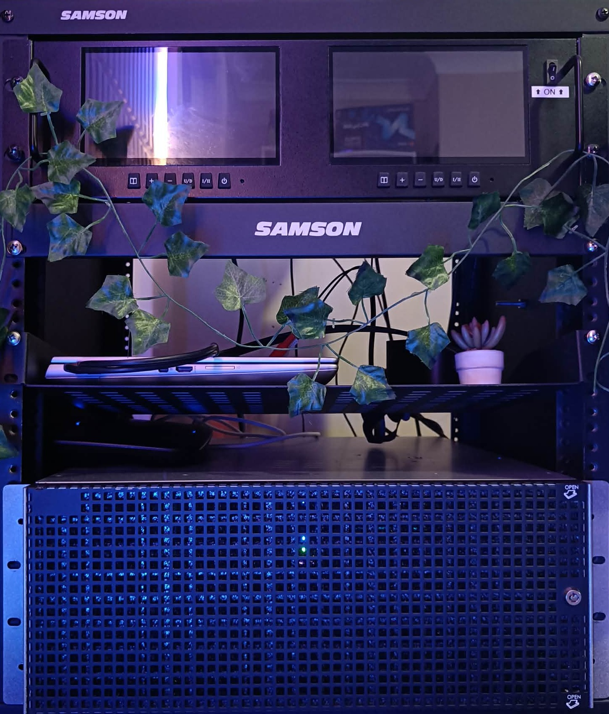

# 🏠 Homelab Journey

> Documenting the design, build, and hardening of a secure, redundant home infrastructure — one change at a time.

This repository tracks the evolution of my homelab: the hardware, the network, the security controls, and the processes that keep it all running. The goal is simple — **host the services I rely on daily, do it securely, and learn by documenting everything.**

---

##  Changelog

### Latest Revision

| Area | Change |
|---|---|
| **Firewall** | Migrated to virtual firewalls distributed across `BUNCEPROX01` & `BUNCEPROX02` for HA |
| **Rack** | Stacked racks to simplify cable management |
| **Rack** | Relocated 3rd cluster downstairs — now serving as a remote gaming rig |
| **Storage** | Moved 4 TB SSD from `BUNCEPROX01` → `BUNCEPROX02` (backup server migrated there) |
| **GPU** | Minor GPU swaps across nodes |

---

##  Network Overview

> *High-level topology — full detail lives in the draw.io source.*

---

##  Primary Goals

### 🔒 Secure Environment
- **SIEM** — Wazuh for log ingestion & threat correlation
- **Firewall** — Virtual, HA pair with locked-down rulesets
- **Syslog** — Centralised logging across all nodes
- **Backup** — TrueNAS + Proxmox Backup Server
- **Network Segmentation** — Separated VLANs per service tier

### 📄 Documented Processes
- Change-management workflow
- Step-by-step deployment guides
- Security hardening checklists

### 🔄 Redundancy & Monitoring
- Redundant firewall pair
- Health monitoring across all services

### 🚀 Service Hosting
- AI workloads (GPU-backed)
- Reverse proxy / edge routing

### 🧪 Lab & Testing
- EVE-NG for network simulation and drills

---

##  Hosted Services

| Service | Purpose | Node | Stack |
|---|---|---|---|
| **Wazuh** | SIEM / threat correlation | `BUNCEPROX01` | Docker |
| **Pi-hole** | DNS filtering / ad blocking | `BUNCEPROX01` | Bare metal |
| **Traefik** | Reverse proxy / SSL termination | `BUNCEPROX01` | Docker |
| **Ollama** | Local AI inference | `BUNCEPROX01` (RTX 3090) | Docker |
| **Gitea** | Self-hosted Git | `BUNCEPROX01` | Docker |
| **Uptime Kuma** | Service monitoring | `BUNCEPROX01` | Docker |
| **n8n** | Workflow automation | `BUNCEPROX01` | Docker |
| **Homepage** | Service dashboard | `BUNCEPROX01` | Docker |
| **Lubelogger** | Vehicle maintenance tracker | `BUNCEPROX01` | Docker |
| **Tududi** | To-do / project tracker | `BUNCEPROX01` | Docker |
| **Mealie** | Meal planning & recipes | `BUNCEPROX01` | Docker |
| **TrueNAS** | Backup & storage | `BUNCEPROX02` | Bare metal |
| **Proxmox Backup Server** | VM / CT backups | `BUNCEPROX02` | Docker |
| **EVE-NG** | Network simulation lab | `BUNCEPROX02` | Bare metal |

> All Docker services are managed via **Docker Compose** 

##  Hardware

###  Helios Rack

| Node | `BUNCEPROX01` | `BUNCEDESKTOP01` |
|---|---|---|
| **CPU** | Ryzen Threadripper 1950X (16C / 32T) | Ryzen Threadripper 2950X (16C / 32T) |
| **RAM** | 128 GB | 48 GB |
| **GPU** | RTX 3090 24 GB + Quadro K620 | RX 9700 XT |
| **Motherboard** | ASUS PRIME X399-A | ASUS PRIME X399-A |
| **Chassis** | 5U | 4U |

###  Citadel Rack

| Spec | Detail |
|---|---|
| **CPU** | Ryzen Threadripper 1920X (16C / 32T) |
| **RAM** | 32 GB (2 × 16 GB) |
| **Motherboard** | GIGABYTE X399 AORUS Gaming 7 |
| **Chassis** | 4U |

---

## 📌 Contributing / Updating

- All changes are logged in the **Changelog** section above

---

*Built and maintained by [The-Bunce](#) · Last updated: 17 September 2026*