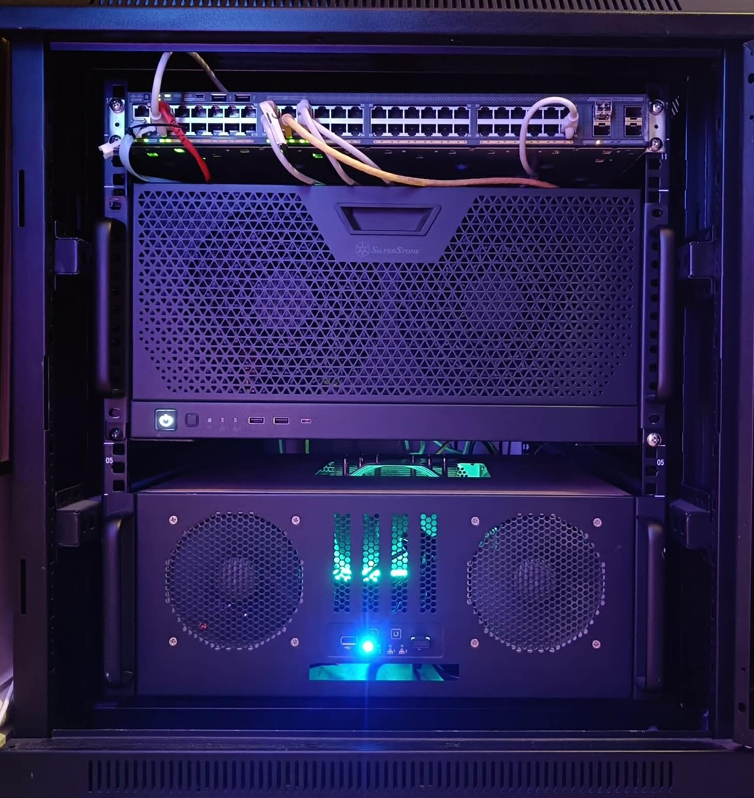

# 🏠 Homelab Journey

> Documenting the design, build, and hardening of a secure, redundant home infrastructure — one change at a time.

This repository tracks the evolution of my homelab: the hardware, the network, the security controls, and the processes that keep it all running. The goal is simple — **host the services I rely on daily, do it securely, and learn by documenting everything.**

---

## 📋 Changelog

### Latest Revision

| Area | Change |
|---|---|
| **Firewall** | Migrated to virtual firewalls distributed across `BUNCEPROX01` & `BUNCEPROX02` for HA |
| **Rack** | Stacked racks to simplify cable management |
| **Rack** | Relocated 3rd cluster downstairs — now serving as a remote gaming rig |
| **Storage** | Moved 4 TB SSD from `BUNCEPROX01` → `BUNCEPROX02` (backup server migrated there) |
| **GPU** | Minor GPU swaps across nodes |

---

## 🌐 Network Overview

> *High-level topology — full detail lives in the draw.io source.*

---

## 🎯 Primary Goals

### 🔒 Secure Environment
- **SIEM** — Wazuh for log ingestion & threat correlation
- **Firewall** — Virtual, HA pair with locked-down rulesets
- **Syslog** — Centralised logging across all nodes
- **Backup** — TrueNAS + Proxmox Backup Server
- **Network Segmentation** — Separated VLANs per service tier

### 📄 Documented Processes
- Change-management workflow
- Step-by-step deployment guides
- Security hardening checklists

### 🔄 Redundancy & Monitoring
- Redundant firewall pair
- Health monitoring across all services

### 🚀 Service Hosting
- AI workloads (GPU-backed)
- Reverse proxy / edge routing

### 🧪 Lab & Testing
- EVE-NG for network simulation and drills

---

## 🖥️ Hardware

### Helios Rack

| Node | `BUNCEPROX01` | `BUNCEDESKTOP01` |
|---|---|---|
| **CPU** | Ryzen Threadripper 1950X (16C / 32T) | Ryzen Threadripper 2950X (16C / 32T) |
| **RAM** | 128 GB | 48 GB |
| **GPU** | RTX 3090 24 GB + Quadro K620 | RX 9700 XT |
| **Motherboard** | ASUS PRIME X399-A | ASUS PRIME X399-A |
| **Chassis** | 5U | 4U |

### Citadel Rack

| Spec | Detail |
|---|---|
| **CPU** | Ryzen Threadripper 1920X (16C / 32T) |
| **RAM** | 32 GB (2 × 16 GB) |
| **Motherboard** | GIGABYTE X399 AORUS Gaming 7 |
| **Chassis** | 4U |

---

## 📌 Contributing / Updating

- All changes are logged in the **Changelog** section above
- Deployment guides and runbooks live under `/docs` *(add when ready)*
- Network source: `Homelab.drawio`

---

*Built and maintained by [Bunce](#) · Last updated: 17 September 2026*